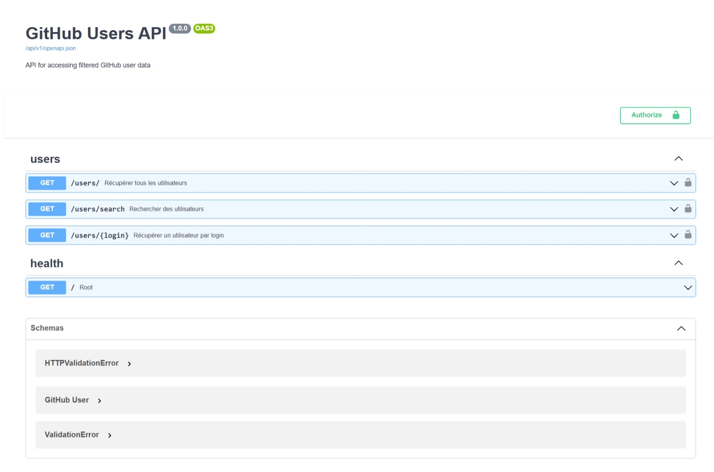
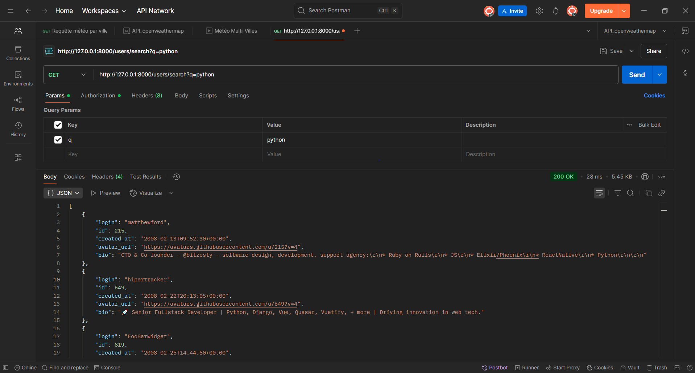

# GitHub Users API


> API REST donnant accès à une base de données filtrée d'utilisateurs GitHub, avec fonctionnalités de recherche et d'authentification.

## 📑 Table des Matières (mise à jour)

1. [Quick Start](#-quick-start)
2. [Installation Détaillée](#-installation-détaillée)
3. [Documentation API](#-documentation-api)
4. [Fonctionnalités](#-fonctionnalités)
5. [Sécurité](#-sécurité)
6. [Guide de Dépannage](#-guide-de-dépannage)
7. [Architecture](#️-architecture)
8. [Performance et Limitations](#-performance-et-limitations)
9. [Contribution](#-contribution)
10. [Support et Contact](#-support-et-contact)

## ⚡ Quick Start

1. **Configuration**
```bash
# Cloner le projet
git clone <votre-repo>
cd <votre-dossier>

# Installer les dépendances
python -m venv venv
.\venv\Scripts\activate
pip install -r requirements.txt

# Configurer l'environnement
copy .env.example .env
# Ajouter votre token GitHub dans .env
```

2. **Extraction des données**
```bash
# Extraire les données brutes
python extract_users.py

# Filtrer les données
python filtered_users.py
```

3. **Lancer l'API**
```bash
uvicorn api.main:app --reload
```

## 💿 Installation Détaillée

1. **Vérifier Python**
```bash
python --version  # Doit afficher Python 3.8+
```

2. **Obtenir un token GitHub**
   - Aller sur [GitHub Settings/Developer settings](https://github.com/settings/tokens)
   - Générer un nouveau token
   - Cocher les permissions nécessaires
   - Copier le token

3. **Configurer le projet**
```bash
# Structure des dossiers
mkdir data
touch .env

# Contenu du .env
echo "GITHUB_TOKEN=votre_token_ici" > .env
```

## 📖 Documentation API

### Endpoints

| Méthode | Endpoint | Description |
|---------|----------|-------------|
| GET | `/users/` | Liste tous les utilisateurs |
| GET | `/users/{login}` | Détails d'un utilisateur |
| GET | `/users/search?q={terme}` | Recherche d'utilisateurs |

### Exemples de Requêtes

**Liste des utilisateurs**
```bash
curl -X GET "http://127.0.0.1:8000/users/" -u admin:admin
```

**Recherche d'utilisateurs**
```bash
curl -X GET "http://127.0.0.1:8000/users/search?q=python" -u admin:admin
```

## 📝 Exemples de Réponses

### GET /users/
```json
{
    "login": "torvalds",
    "id": 1024025,
    "created_at": "2011-09-03T15:26:22Z",
    "avatar_url": "https://avatars.githubusercontent.com/u/1024025?v=4",
    "bio": "Creator of Linux and Git"
}
```

### GET /users/search?q=linux
```json
[
    {
        "login": "torvalds",
        "id": 1024025,
        "created_at": "2011-09-03T15:26:22Z",
        "avatar_url": "https://avatars.githubusercontent.com/u/1024025?v=4",
        "bio": "Creator of Linux and Git"
    }
]
```

## 🔒 Sécurité & Authentification

**Basic Auth**
- Username: `admin`
- Password: `admin`

**Headers requis**
```http
Authorization: Basic YWRtaW46YWRtaW4=
Accept: application/json
```

## 🚀 Fonctionnalités

- ✨ Liste filtrée d'utilisateurs GitHub
- 🔍 Recherche par login et bio
- 👤 Détails des profils utilisateurs
- 🔒 Authentification Basic Auth
- 📚 Documentation Swagger/ReDoc

## 🔧 Guide de Dépannage

### Problèmes courants

1. **Erreur d'authentification**
```bash
{"detail": "Not authenticated"}
```
➡️ Solution : Vérifier les credentials (admin/admin)

2. **Rate Limiting GitHub**
```bash
{"message": "API rate limit exceeded"}
```
➡️ Solution : Attendre que la limite se réinitialise ou utiliser un nouveau token

3. **Données non disponibles**
```bash
{"detail": "User {id} not found"}
```
➡️ Solution : Relancer l'extraction des données avec `extract_users.py`

## ⚙️ Architecture & Technique

```
api/
├── __init__.py
├── main.py          # FastAPI app
├── models.py        # Modèles de données
├── routes.py        # Endpoints
└── security.py      # Authentification
```

## 📊 Performance et Limitations

### Temps de traitement moyens
- Extraction initiale : ~30 min pour 3000 utilisateurs
- Filtrage des données : ~5 sec
- Réponse API : <100ms

### Utilisation des ressources
- RAM : ~500MB
- Stockage : ~5GB (données brutes + filtrées)
- CPU : Modéré pendant l'extraction

### Limitations
- Maximum 3000 utilisateurs
- Pas de pagination
- Recherche : minimum 3 caractères
- Rate limiting GitHub API

## 📝 TODO

- [ ] Ajouter la pagination
- [ ] Implémenter un cache Redis
- [ ] Ajouter des tests unitaires
- [ ] Documenter les codes d'erreur

## 🤝 Contribution

1. **Installation pour développement**
```bash
# Créer une branche
git checkout -b feature/ma-fonctionnalite

# Installer les dépendances de développement
pip install -r requirements-dev.txt
```

2. **Tests**
```bash
# Lancer les tests
pytest tests/

# Vérifier la couverture
pytest --cov=api tests/
```

3. **Soumission**
   - Créer une Pull Request
   - Décrire les changements
   - Ajouter des tests

## 📄 License

MIT License - voir [LICENSE](LICENSE)

## 🛠️ Environnement de Développement

### VS Code

Extensions recommandées :
- Python
- FastAPI
- Thunder Client
- Git Graph

Settings recommandés :
```json
{
    "python.linting.enabled": true,
    "python.formatting.provider": "black",
    "editor.formatOnSave": true
}
```

## 📸 Captures d'écran

### Interface de Documentation (Swagger UI)

*Interface interactive permettant de tester l'API directement depuis le navigateur*

### Exemple de Réponse API

*Exemple de réponse JSON pour la requête GET /users/*

### Structure des Données
```json
{
    "login": "torvalds",
    "id": 1024025,
    "created_at": "2011-09-03T15:26:22Z",
    "avatar_url": "https://avatars.githubusercontent.com/u/1024025?v=4",
    "bio": "Creator of Linux and Git"
}
```
*Structure type d'un objet utilisateur*

## 🔄 Versions et Compatibilité

### Dépendances principales
| Package | Version | Usage |
|---------|---------|-------|
| FastAPI | ^0.68.0 | Framework API |
| Pydantic | ^1.8.0 | Validation des données |
| Uvicorn | ^0.15.0 | Serveur ASGI |
| Requests | ^2.26.0 | Client HTTP |
| python-dotenv | ^0.19.0 | Gestion configuration |

### Systèmes d'exploitation supportés
- Windows 10/11
- Linux (Ubuntu 20.04+)
- macOS (10.15+)

2. **Badge supplémentaires** :
```markdown


```

## 📫 Contact et Support

Pour toute question ou problème :
- Ouvrir une issue
- Me contacter sur [LinkedIn](votre-profil)
- Email : votre@email.com

## 📝 Changelog

### v1.0.0 (2024-01-19)
- Version initiale
- Authentification Basic Auth
- Endpoints de base